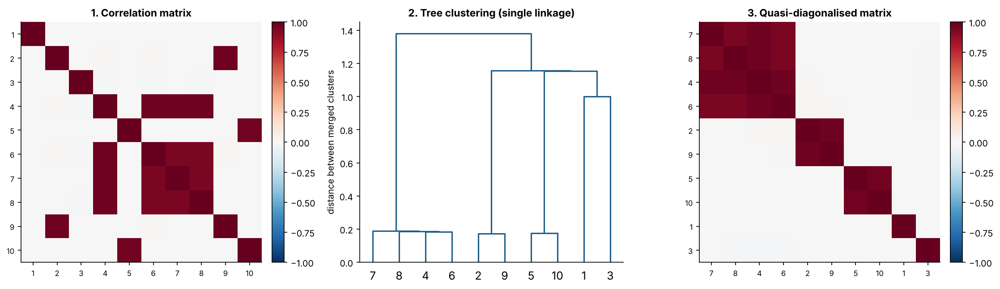
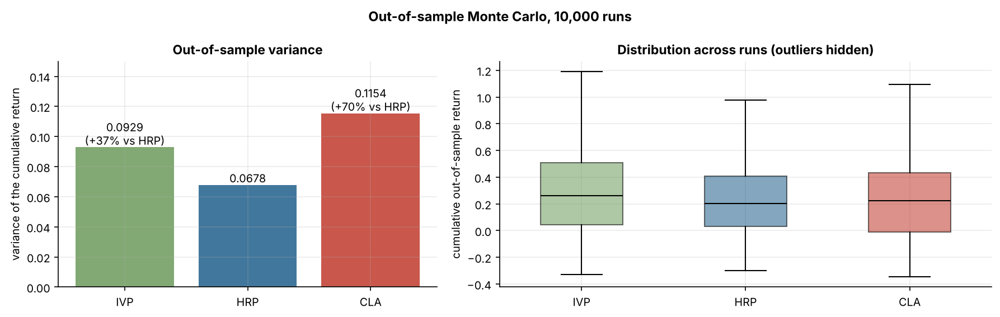
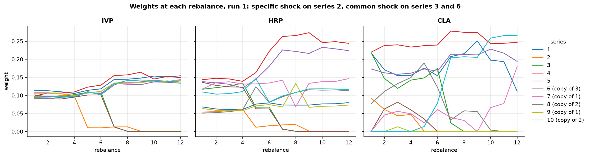
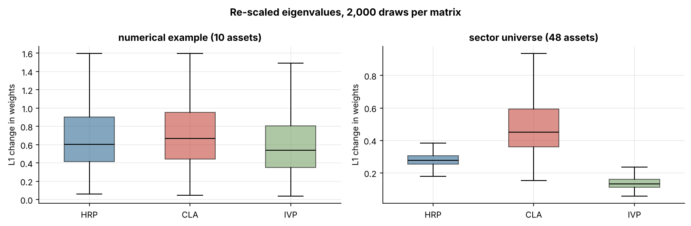
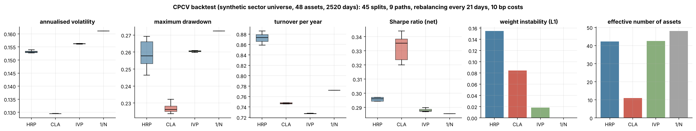
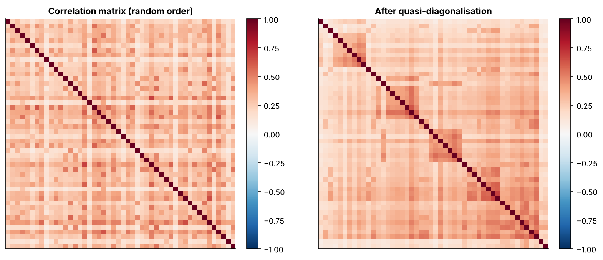

# Hierarchical Risk Parity

[](https://github.com/Alzak2208/hierarchical-risk-parity/actions/workflows/ci.yml)

An implementation of Hierarchical Risk Parity (HRP), benchmarked against the minimum-variance
portfolio (computed with my own implementation of the Critical Line Algorithm) and against the
inverse-variance portfolio. The method, the numerical example and the out-of-sample Monte
Carlo follow the original study listed in the [references](#references). The
repository also runs a spectral stress test, measures how much HRP depends on the order of the
assets, and adds a combinatorial purged cross-validation (CPCV) backtest with periodic
rebalancing and transaction costs that runs on simulated data or on real prices (for instance a
Databento export).

## Why HRP

A mean-variance optimiser has to invert the covariance matrix. When assets are strongly
correlated, that matrix has a large condition number and its inverse amplifies estimation
error: a small change in one covariance entry can reshuffle the whole portfolio. In graph terms,
the optimiser treats every asset as a potential substitute for every other one.

HRP replaces that complete graph with a tree. Capital flows top-down through the tree, and at
each level it is only shared between two neighbouring groups of assets. No matrix is inverted,
so the method still works on an ill-conditioned or singular covariance matrix.

## The algorithm

| Stage | What it does | Code |
|---|---|---|
| 1. Tree clustering | Correlation distance $d_{ij} = \sqrt{(1-\rho_{ij})/2}$, then the Euclidean distance between columns of $D$ (each entry uses the whole correlation structure), then single-linkage agglomerative clustering. | [`src/clustering.py`](src/clustering.py) |
| 2. Quasi-diagonalisation | Assets are reordered along the leaves of the dendrogram, so similar assets sit next to each other and the covariance matrix becomes quasi-diagonal. | [`src/clustering.py`](src/clustering.py) |
| 3. Recursive bisection | The ordered list is cut in two halves. Each half's variance is measured with its own inverse-variance portfolio, $V_j = \tilde w_j' \Sigma_j \tilde w_j$. The first half receives $\alpha = 1 - V_1/(V_1+V_2)$ of the parent's weight, the second $1-\alpha$. Repeat inside each half. | [`src/allocation.py`](src/allocation.py) |

Weights are long-only and sum to one by construction.

## Implementation notes

- The three-asset worked example of the original study is used as a unit test: its distance
  matrices (0.3873, 0.6325, 0.7746, then 0.5659, 0.9747, 1.1225) and its two merges are
  checked to four decimals.
- The quasi-diagonal order is computed by a depth-first walk of the linkage matrix and is
  tested against `scipy.cluster.hierarchy.leaves_list`.
- The Critical Line Algorithm is written from scratch ([`src/cla.py`](src/cla.py)). It walks
  the efficient frontier from maximum return ($\lambda = \infty$) down to minimum variance
  ($\lambda = 0$), stopping at each turning point where an asset reaches or leaves a bound.
  Between turning points the weights are linear in $\lambda$. Tests check the whole frontier
  against an exact solution obtained by enumerating every free set (agreement to $10^{-8}$),
  the minimum-variance portfolio against SLSQP (to $10^{-6}$), custom bounds, and the case of a
  diagonal covariance, where the minimum-variance portfolio must equal the inverse-variance one.
- On singular matrices, the CLA only inverts the covariance block of its free assets, so the
  long-only constraint lets it survive some rank-deficient matrices; when that block cannot be
  inverted it raises `SingularCovarianceError`. HRP never inverts anything (tested with an exact
  duplicate asset and with more assets than observations).
- The HRP allocation depends on the order in which the assets are listed. Stage 1 fixes
  which assets merge, but scipy decides which branch is drawn on the left from the cluster ids,
  and stage 3 cuts the leaf order by position. Optional optimal leaf ordering removes that
  dependence (`hrp_weights(cov, optimal_ordering=True)`, see the results below). It is off by
  default to stay faithful to the original method.

## Results

All numbers below are produced by the scripts in [`analysis/`](analysis/) with fixed seeds, and
saved as CSV files in [`results/`](results/). The simulations use numpy's current generator, so
individual draws differ from those of the original study (which used Python 2 random numbers),
but the comparisons come out the same way.

### 1. The three stages on a numerical example

Five independent series and five noisy copies (series 6, 7 and 8 are copies of 4, series 9 of 2
and series 10 of 5 in this draw). The clustering recovers every copy and the quasi-diagonal
matrix shows the blocks.



| Asset | CLA | HRP | IVP |
|---:|---:|---:|---:|
| 1 | 19.52% | 14.18% | 10.06% |
| 2 | 19.66% | 6.35% | 10.18% |
| 3 | 20.64% | 14.63% | 10.38% |
| 4 | 19.86% | 6.57% | 10.38% |
| 5 | 20.00% | 14.56% | 10.41% |
| 6 | 0.00% | 6.06% | 9.72% |
| 7 | 0.10% | 5.23% | 9.74% |
| 8 | 0.06% | 5.21% | 9.71% |
| 9 | 0.00% | 13.40% | 9.58% |
| 10 | 0.17% | 13.83% | 9.85% |
| **Top-5 share** | **99.67%** | **70.59%** | **51.40%** |
| **In-sample volatility** | **0.4456** | **0.4643** | **0.5090** |

The CLA puts almost everything on five assets and drops the copies, for an in-sample volatility
only 4% below HRP's (the original study reports 0.4486 against 0.4640). In HRP, the four
series of the {4, 6, 7, 8} cluster share 23% between them, while the isolated series 1 and 3
get about 14% each. Series 2 and its copy 9 get very different weights (6.35% and 13.40%): the leaf order is
7, 8, 4, 6, 2 | 9, 5, 10, 1, 3 and the first bisection cuts it between them. The table of the
original study shows the same effect (7.59% for series 2, 12.79% for its copy 10). IVP ignores
correlations and spreads the capital evenly. The condition number of this covariance matrix is
260.5.

### 2. Out-of-sample Monte Carlo

10,000 simulated histories of 520 days for 10 series, with jumps of -50% and +200% in the
second half: a common shock on a series and its copy, and a specific shock on one series. Each
method is estimated on the previous 260 days and rebalanced every 22 days. The table reports
the variance, across runs, of each portfolio's cumulative out-of-sample return.

| Method | Variance | vs HRP | Original study (variance, vs HRP) |
|---|---:|---:|---:|
| HRP | 0.0678 | | 0.0671 |
| IVP | 0.0929 | +36.9% | 0.0928, +38.24% |
| CLA | 0.1154 | +70.1% | 0.1157, +72.47% |

The minimum-variance portfolio has the highest variance out of sample. The original study
explains it by the shocks: a shock on one asset penalises the CLA's concentration, and a shock on several
correlated assets penalises IVP, which ignores correlations.



In the first run, series 6 is a copy of series 3, series 7 and 9 are copies of 1, and series 8
and 10 are copies of 2. Series 2 takes a specific -50% return, which enters the estimation
window at rebalance 5, and series 3 and 6 take a common -50% return, which enters at
rebalance 7.

- Rebalance 5: IVP cuts series 2 by 8.8 points and spreads them over the nine others (+0.6 to
  +1.4 each). HRP cuts series 2 by 5.0 points and gives the most to its copies 8 (+6.4) and
  10 (+3.6), as in the original study. It also cuts series 3 (-6.7) and 6 (-6.0), which have not been
  hit yet: the shock changes the tree and the pair {3, 6} moves to the other half of the first
  bisection.
- Rebalance 7: IVP cuts series 3 and 6 by 9.7 and 8.9 points and spreads them over the others.
  HRP cuts them by 6.1 and 5.6 points, and its largest increases go to series 4 and 5, which
  are not correlated with them.
- The CLA makes the largest moves, for instance -15.1 points on series 3 and +12.5 on
  series 10 at rebalance 7.
- At rebalances 8 and 9, HRP moves about 7 points back and forth between series 7 and 9,
  which are never hit: the shocks entering the window reorder the leaves and the two series
  change subgroup in the bisection (see section 4).



### 3. Spectral stress test

The eigenvalues of the covariance matrix are randomly re-scaled
($\tilde\lambda_n = N \varepsilon_n \lambda_n / \sum_k \varepsilon_k$, $\varepsilon \sim U[0,1]$)
and the eigenvectors are kept. The multipliers $N \varepsilon_n / \sum_k \varepsilon_k$ average
one, but the total variance changes from one draw to the next. This does not affect the
comparison, since none of the three allocations changes when the covariance matrix is
multiplied by a constant. Each method is re-run on the stressed matrix and the L1 change in
weights is recorded over 2,000 draws.

| Mean L1 change | HRP | CLA | IVP |
|---|---:|---:|---:|
| Numerical example (10 assets) | 0.669 | 0.711 | 0.592 |
| Sector universe (48 assets) | 0.286 | 0.513 | 0.141 |

The CLA is the method most affected by the re-scaling. On the 48-asset universe, HRP moves about half as much as the CLA. IVP moves least because it only
looks at the diagonal.



### 4. Does the order of the assets matter?

Listing the same assets in 200 random orders and re-running HRP:

| L1 change in weights | Default leaf order (mean / max) | Optimal leaf order |
|---|---:|---:|
| Numerical example (10 assets) | 0.084 / 0.158 | 0 |
| Sector universe (48 assets) | 0.042 / 0.085 | 0 |

With the default tree, merely listing the assets in another order can move up to 8% of the
capital (an L1 distance of 0.158). Optimal leaf ordering makes the allocation a function of the
data only.

### 5. CPCV backtest with rebalancing and costs

[`src/cpcv.py`](src/cpcv.py) cuts the history into $N$ contiguous groups and uses every
combination of $k$ groups as a test set, which gives $\binom{N}{k}$ train/test splits whose
test segments stitch into $\binom{N-1}{k-1}$ complete out-of-sample paths instead of a single
historical path. Training observations next to a test group are purged (before) and embargoed
(after) to limit leakage through serial dependence.

[`src/backtest.py`](src/backtest.py) estimates each allocation on the training set of a split,
then holds it along the paths: rebalancing to target at the start of each group and every
21 days, weights drifting with returns in between, and 10 bp of cost per unit of turnover.
Settings here: $N = 10$, $k = 2$ (45 splits, 9 paths), a 1% embargo.

The data is a synthetic equity-like universe: 48 assets in 6 sectors over 10 years, with a market
factor, sector factors, Student-t innovations, heterogeneous betas and volatilities, and rare
single-name jumps. Every asset has the same expected return, so the comparison is about risk.

| Mean over the 9 paths | HRP | CLA | IVP | 1/N |
|---|---:|---:|---:|---:|
| Volatility | 15.3% | 12.9% | 15.6% | 16.1% |
| Maximum drawdown | 25.9% | 22.7% | 26.0% | 27.2% |
| Sharpe ratio (net) | 0.30 | 0.33 | 0.29 | 0.29 |
| Turnover per year | 0.87 | 0.75 | 0.73 | 0.77 |
| Weight instability (L1) | 0.155 | 0.085 | 0.019 | 0 |
| Effective number of assets | 42.2 | 10.9 | 42.5 | 48 |
| Share of zero weights | 0% | 61.9% | 0% | 0% |

*Weight instability is the average L1 distance between the allocation estimated on each of the
45 training sets and their mean; the effective number of assets is $1/\sum_i w_i^2$.*



Unlike in the Monte Carlo of section 2, the covariance matrix is stationary here and estimated
on about 2,000 observations, and every asset has the same expected return, so the
minimum-variance portfolio is also the best risk-adjusted one in theory. The CLA delivers it:
the lowest volatility and drawdown, with about 11 effective names and 62% of the universe at
zero. HRP keeps a diversification close to IVP's while using the correlation structure.

Its weights, however, move more than the CLA's from one training set to the next, which goes
against the stability the original study attributes to HRP. The cause is the tree
([`results/cpcv_tree_stability_synthetic.csv`](results/cpcv_tree_stability_synthetic.csv)): the
45 training sets give 45 different trees, which share on average 66% of their clusters with the
tree of the full sample, and single linkage never isolates a sector (none of the six sectors is
a cluster of the full-sample tree). Every change of tree moves some assets from one half of the
bisection to the other. Optimal leaf ordering does not help (instability 0.158 instead of
0.155), because the branches themselves change, not only the side on which they are drawn. In
section 2 the shocks hit the out-of-sample period and penalise the CLA's concentration; here
the future looks like the past, so concentration costs little.



## Running the CPCV backtest on real prices

The loader in [`src/data.py`](src/data.py) reads a Databento OHLCV-1d export (`ts_event`,
`symbol`, `close`, as a column or as the index), a wide price table, or a directory of such
files (Parquet or CSV). Licensed data stays out of the repository (`data/` is ignored).

```bash
pip install -e ".[data]"
python -m analysis.cpcv_backtest --prices data/equities_ohlcv-1d.parquet
```

Assets with less than 95% of the history are dropped, gaps of up to five days are filled, and
results go to `results/real/`. Databento OHLCV bars are not adjusted for splits or dividends, so
the loader warns about daily moves above 40% (`--min-coverage`, the CPCV settings and the cost
level are command-line options).

## Reproducing everything

```bash
git clone https://github.com/Alzak2208/hierarchical-risk-parity.git
cd hierarchical-risk-parity
pip install -e ".[dev]"            # or: conda env create -f environment.yml

python -m analysis.numerical_example   # numerical example
python -m analysis.monte_carlo         # 10,000 runs (a few minutes, uses every core)
python -m analysis.spectral_stress
python -m analysis.order_invariance
python -m analysis.cpcv_backtest       # synthetic universe

pytest tests/ -v                       # 73 tests
ruff check . && ruff format --check .
```

## Project structure

```
├── src/
│   ├── clustering.py    # stages 1 and 2: correlation distance, tree, quasi-diagonal order
│   ├── allocation.py    # stage 3 and HRP, inverse-variance and 1/N portfolios
│   ├── cla.py           # Critical Line Algorithm: turning points, minimum variance
│   ├── cpcv.py          # combinatorial purged cross-validation (splits and paths)
│   ├── backtest.py      # allocation backtest: rebalancing, drift, transaction costs
│   ├── metrics.py       # volatility, Sharpe, drawdown, concentration, weight instability
│   ├── simulation.py    # numerical example, Monte Carlo draws, synthetic sector universe
│   └── data.py          # Databento / wide price loaders and return cleaning
├── analysis/            # one script per study, writes to results/
├── results/             # figures and CSV tables
├── tests/               # unit and numerical-correctness tests
├── environment.yml
└── pyproject.toml       # dependencies, pytest and ruff configuration
```

## References

- Bailey, D. and López de Prado, M. (2013). An open-source implementation of the critical-line
  algorithm for portfolio optimization. *Algorithms*, 6(1), 169-196.
- Bar-Joseph, Z., Gifford, D. and Jaakkola, T. (2001). Fast optimal leaf ordering for
  hierarchical clustering. *Bioinformatics*, 17(suppl. 1), S22-S29.
- DeMiguel, V., Garlappi, L. and Uppal, R. (2009). Optimal versus naive diversification: how
  inefficient is the 1/N portfolio strategy? *Review of Financial Studies*, 22, 1915-1953.
- López de Prado, M. (2016). Building diversified portfolios that outperform out of sample.
  *Journal of Portfolio Management*, 42(4), 59-69.
- López de Prado, M. (2018). *Advances in Financial Machine Learning*. Wiley.
- Markowitz, H. (1952). Portfolio selection. *Journal of Finance*, 7(1), 77-91.
- Markowitz, H. (1956). The optimization of a quadratic function subject to linear
  constraints. *Naval Research Logistics Quarterly*, 3(1-2), 111-133.
- Merton, R. (1976). Option pricing when underlying stock returns are discontinuous. *Journal of
  Financial Economics*, 3, 125-144.
- Michaud, R. (1998). *Efficient Asset Allocation: A Practical Guide to Stock Portfolio
  Optimization and Asset Allocation*. Harvard Business School Press.
- Rokach, L. and Maimon, O. (2005). Clustering methods. In Rokach, L. and Maimon, O. (eds.),
  *Data Mining and Knowledge Discovery Handbook*. Springer, 321-352.
